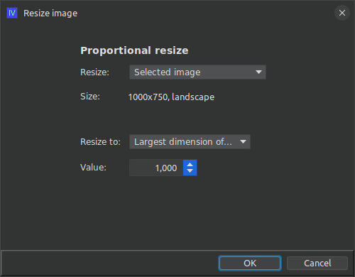
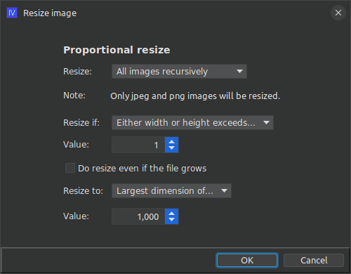

# ext-iv-image-resize

## What is this?

This is an extension for ImageViewer to handle batch resizing of images. 

### How do I use it?

Clone the repo and build the extension jar with maven:

```shell
git clone https://github.com/scorbo2/ext-iv-image-resize.git
cd ext-iv-image-resize
mvn package
```

Now you can copy the extension jar to wherever you keep your imageviewer extensions:

```shell
cp target/ext-iv-image-resize-2.1.0.jar ~/.ImageViewer/extensions/
```

Now restart imageviewer and hit Ctrl+S or select "Resize image" from the "Edit" menu.

If you choose to resize a single image, you will see the image's current dimensions, and will be given an opportunity to input a new maximum 
width or height for the image to be scaled proportionally. The resized image will automatically overwrite the original image. The single-image
resize dialog is shown below:



If, however, you choose to resize all images in the current directory, or all images in the current directory and all subdirectories
recursively, you will be presented with additional options, shown here:



Here you are able to set a resize trigger. This means that the resize will only occur if the source image exceeds a certain size threshold that
you specify here. You can also specify the resize target dimensions. Finally, you can specify that the resize should occur, even if the resized
image has a larger file size than the source image. This is handy if you are downscaling very large images to save space on disk - there's no
point in performing such a resize if the resulting file size is larger than the input.

### Requirements

ImageViewer 2.1 or higher.

### License

Imageviewer and this extension are made available under the MIT license: https://opensource.org/license/mit
