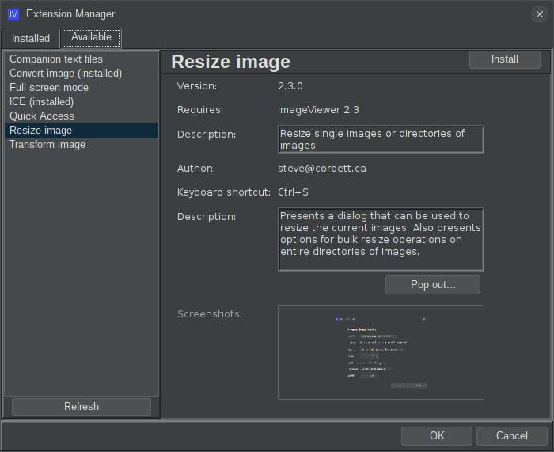
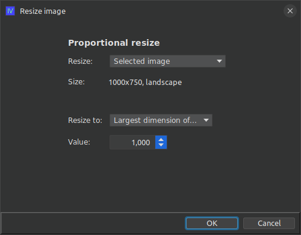
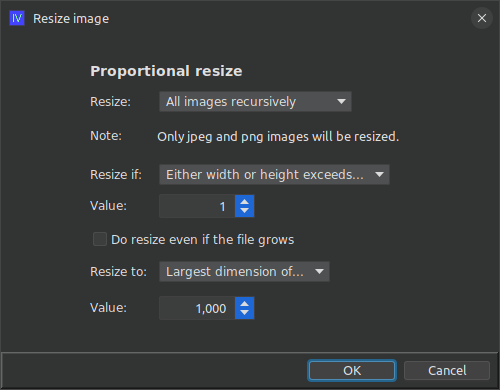

# ext-iv-image-resize

## What is this?

This is an extension for the [ImageViewer](https://github.com/scorbo2/imageviewer) application to handle batch resizing of images. 

## How do I get it?

### Option 1: automatic download and install

**New!** Starting with the 2.3 release of ImageViewer, you no longer have to manually build and install application extensions!
Now, you can visit the "Available" tab in the new and improved extension manager dialog:



Select "Resize image" from the list on the left and then hit the "Install" button in the top right.
If you decide later to remove the extension, come back to the extension manager dialog, select "Resize image"
from the list on the left, and hit the "Uninstall" button in the top right. The application will prompt to restart.
It's just that easy!

### Option 2: manual download and install

You can manually download the extension jar:
[ext-iv-image-resize-3.0.0.jar](https://www.corbett.ca/apps/ImageViewer/extensions/3.0/ext-iv-image-resize-3.0.0.jar)

Save it to your ~/.ImageViewer/extensions directory and restart the application.

### Option 3: build from source

You can clone this repo and build the extension jar with Maven (Java 17 or higher required).
Note: you must have run `mvn install` on the main ImageViewer repo first, as that is a dependency for this code.

```shell
git clone https://github.com/scorbo2/ext-iv-image-resize.git
cd ext-iv-image-resize
mvn package

# Copy the result to extensions dir:
cp target/ext-iv-image-resize-3.0.0.jar ~/.ImageViewer/extensions/
```

## Okay, it's installed, now how do I use it?

Once ImageViewer has restarted, you can hit Ctrl+S or select "Resize image" from the "Edit" menu.

If you choose to resize a single image, you will see the image's current dimensions, and will be given an opportunity to input a new maximum 
width or height for the image to be scaled proportionally. The resized image will automatically overwrite the original image. The single-image
resize dialog is shown below:



If, however, you choose to resize all images in the current directory, or all images in the current directory and all subdirectories
recursively, you will be presented with additional options, shown here:



Here you are able to set a resize trigger. This means that the resize will only occur if the source image exceeds a certain size threshold that
you specify here. You can also specify the resize target dimensions. Finally, you can specify that the resize should occur, even if the resized
image has a larger file size than the source image. This is handy if you are downscaling very large images to save space on disk - there's no
point in performing such a resize if the resulting file size is larger than the input.

## Requirements

Compatible with any ImageViewer 3.x release.

## License

ImageViewer and this extension are made available under the MIT license: https://opensource.org/license/mit
